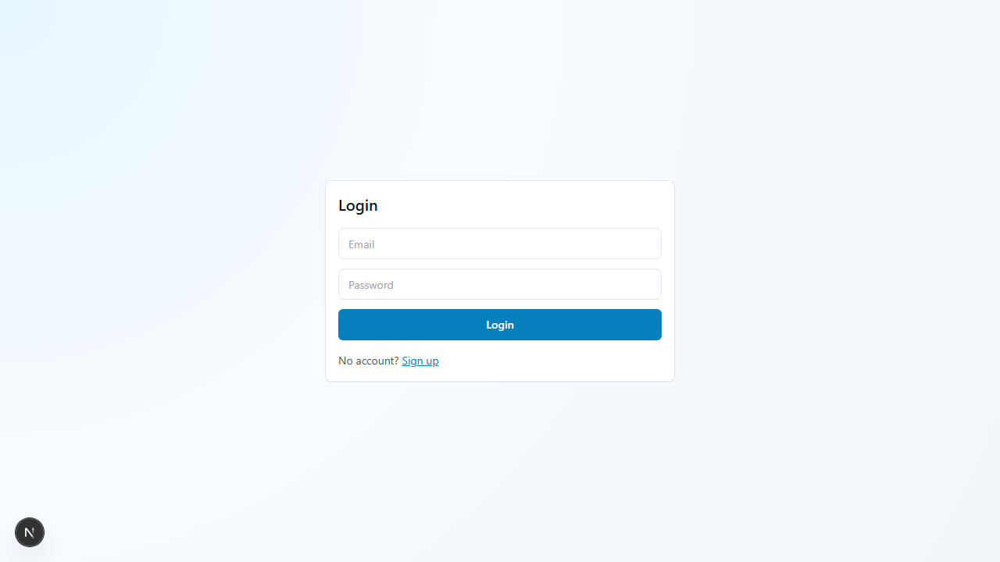

# Social Media Control Center

> **Status: verified local MVP.** The application, API, worker boundaries, safe demo, tests, build, and audits are verified. Live social publishing is not claimed; it still requires approved provider apps, credentials, and sandbox validation.

[](https://jashwanth-portfolio-ten.vercel.app/work/social-media-control-center/)

[Open MP4](https://jashwanth-portfolio-ten.vercel.app/media/social-media-control-center/demo.mp4) · [Download WebM](https://jashwanth-portfolio-ten.vercel.app/media/social-media-control-center/demo.webm) · [Captions](https://jashwanth-portfolio-ten.vercel.app/media/social-media-control-center/demo-captions.vtt)

The walkthrough runs the real Next.js interface against a deterministic local demo API. Every account, publishing result, external ID, and chart is synthetic, and the verifier confirms that no social provider is contacted.

[Case study](docs/CASE_STUDY.md) · [Architecture](docs/ARCHITECTURE.md) · [Test evidence](docs/TEST_REPORT.md) · [UX audit](docs/audit/UX_AUDIT.md) · [Security](SECURITY.md) · [Release notes](docs/RELEASE_NOTES_v1.0.0.md)

## Product thesis

Cross-platform publishing should expose provider differences instead of hiding them. SMCC keeps credentials and provider calls behind a FastAPI boundary, creates one delivery target per account, queues retryable work, and shows the status of every target independently.

## Verified workflow

1. Sign in to an application workspace.
2. Review connected-account capabilities and token health.
3. Compose text with an optional link or supported image.
4. Select explicit accounts or post to all.
5. Inspect `queued`, `publishing`, and terminal per-provider results.
6. Review bounded retry evidence and conservative snapshot analytics.

## Architecture

- **Web:** Next.js 16, TypeScript, Tailwind, React Hook Form, Zod, Recharts
- **API:** FastAPI, Pydantic Settings, SQLAlchemy 2, Alembic
- **Persistence:** PostgreSQL
- **Jobs:** Redis and RQ with bounded retry intervals
- **Media:** MinIO-compatible object storage for local development
- **Security:** bcrypt passwords, HS256 application sessions, Fernet-encrypted provider tokens, production configuration guards, CORS and rate limiting
- **Connectors:** Facebook Pages, LinkedIn, and X boundaries; Instagram remains a stated stub

## Evidence

| Check | Verified result |
|---|---|
| API tests | 19 passed |
| Frontend lint | Passed |
| Production static build | Passed, 10 routes plus not-found |
| Browser workflow | Passed in bundled Chromium with zero external requests |
| Responsive audit | 390 px reflow, keyboard focus, mobile navigation, Escape close, and reduced motion passed |
| JavaScript dependencies | `npm audit --audit-level=moderate`: 0 vulnerabilities |
| Python dependencies | `pip-audit -r requirements.txt`: no known vulnerabilities |
| Secret scan | Current tracked release archive: no leaks found |
| Walkthrough | 245.368 seconds, 1280×720, VP9 video, Opus narration, captions, 10 inspected frames |

See [docs/TEST_REPORT.md](docs/TEST_REPORT.md) for exact commands and limits.

## Run the production-shaped safe demo

Prerequisites: Node.js 22+, Python 3.13+, and PowerShell on Windows for the all-in-one recorder.

```powershell
python -m pip install -r apps/api/requirements.txt
npm ci --prefix apps/web
powershell -NoProfile -ExecutionPolicy Bypass -File scripts\record-demo.ps1 -SmokeOnly
```

The script builds the static frontend, starts the provider-isolated demo API and clean-route server, verifies the API workflow, and drives the complete browser path. Run without `-SmokeOnly` only when a new 3+ minute release video is required.

Demo credentials are labels rather than real secrets:

```text
recruiter@example.com
demo-pass-2026
```

## Run the full local stack

1. Copy `apps/api/.env.example` to `apps/api/.env` and replace placeholders.
2. Generate `TOKEN_ENCRYPTION_KEY` with Fernet and a unique `SECRET_KEY` of at least 32 characters.
3. Start PostgreSQL, Redis, and MinIO with `infra/docker-compose.yml`.
4. Run migrations from `apps/api` with `alembic upgrade head`.
5. Start FastAPI on `:8000` and an RQ worker for the `publish` and `snapshot` queues.
6. Set `NEXT_PUBLIC_API_BASE=http://localhost:8000`, then run the web app from `apps/web`.

Production startup rejects a short/default signing secret and rejects `DEV_MODE=true`. Developer token-paste endpoints are disabled by default and must never be enabled in production.

## Deployment shape

The static frontend can be deployed to Netlify using the root `netlify.toml`. The API, worker, PostgreSQL, Redis, and object storage need separate services such as Render-managed components. Required deployment values and provider callback examples are documented in `apps/api/.env.example` and [docs/DEVELOPMENT.md](docs/DEVELOPMENT.md).

Deployment is not currently presented as verified. Domains, paid services, provider consoles, credentials, retention policy, and monitoring remain human checkpoints.

## Provider boundary

- OAuth redirect URIs must match the deployed callback exactly.
- Requested scopes require provider approval and may vary by account type.
- Tokens are backend-only and encrypted at rest, but production rotation and revocation still need deployment validation.
- No scraping is used.
- Image publishing is currently disabled for Facebook, LinkedIn, and X.
- Individual unfollower identity is shown only when an official connector can provide it; current analytics use follower-count deltas.
- Instagram publishing is scaffolded, not complete.

## Documentation

- [Development and setup](docs/DEVELOPMENT.md)
- [Architecture and trust boundaries](docs/ARCHITECTURE.md)
- [Testing evidence](docs/TEST_REPORT.md)
- [Security policy](SECURITY.md)
- [Case study](docs/CASE_STUDY.md)
- [Interview guide](docs/INTERVIEW_GUIDE.md)
- [Demo script and recording acceptance](docs/demo/DEMO_SCRIPT.md)
- [Contribution guide](CONTRIBUTING.md)

## Limitations

This release does not prove live provider publishing, provider-review approval, production throughput, multi-region resilience, production retention/deletion workflows, or cross-browser visual parity. Windows Chromium is the visually audited desktop environment; CI uses Linux for code/build verification.
