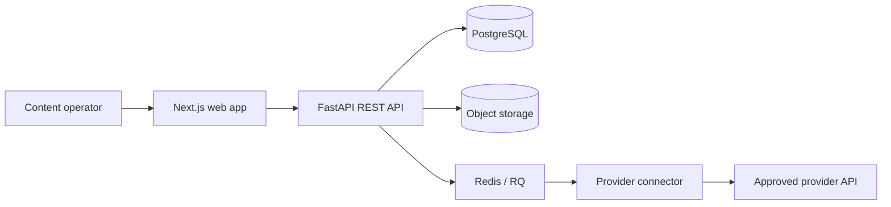

# Social Media Control Center architecture

## System view

## Primary workflow

The browser sends one validated post request. The API resolves only accounts owned by the signed-in user, validates connector capabilities, persists one `Post`, and creates a `PostTarget` per account. Each target is enqueued independently. Workers move targets through `queued`, `publishing`, and a terminal status: `success`, `failed`, `rate_limited`, or `needs_reauth`.

This model prevents one provider result from overwriting another and makes retry evidence visible through attempts and external IDs.

## Trust boundaries

- **Browser → API:** application bearer token; browser never receives provider secrets.
- **API → database:** users, encrypted OAuth tokens, posts, targets, follower snapshots.
- **API → queue:** numeric target identifiers and bounded retry policy.
- **Worker → connector:** decrypted token only inside the backend process.
- **Connector → provider:** live network boundary requiring approved credentials and scopes.
- **Media → object storage:** authenticated upload boundary; deployment-specific size, malware, and retention controls remain required.

## Safe demo architecture

`scripts/demo_api.py` is a separate deterministic FastAPI process. It does not import connector code, does not read provider environment variables, and does not perform outbound requests. It resets synthetic state at sign-in and advances a created target from publishing to success after a fixed interval. OAuth start endpoints return an explicit blocked response.

The browser workflow additionally records every HTTP request and fails if any non-local host is contacted.

## Security controls

- bcrypt password hashing with 12 rounds
- bounded password input length
- PyJWT HS256 application tokens
- Fernet encryption for stored provider tokens
- production startup rejection for default/short signing keys or enabled developer mode
- user-scoped account, post, and analytics queries
- OAuth state and production redirect validation
- CORS allow-list and request rate limiting
- generic 500 responses that do not disclose exception details

## Scaling limits

The current release limits post history to 50 and dashboard history to 10, but does not yet provide cursor pagination. Production scale would require queue-latency metrics, idempotency keys, dead-letter inspection, upload policies, database indexes validated under load, provider-specific rate budgets, and operational dashboards. No throughput number is claimed.
