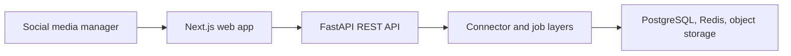

# Social Media Control Center architecture

Full-stack control center for composing, scheduling, publishing, and analyzing social content through pluggable connectors.

## System view

## Component boundaries

- **Social media manager:** initiates the primary workflow.
- **Next.js web app:** owns one stage of the request or interaction flow.
- **FastAPI REST API:** owns one stage of the request or interaction flow.
- **Connector and job layers:** owns one stage of the request or interaction flow.
- **PostgreSQL, Redis, object storage:** provides the terminal integration or persistence boundary.

## Runtime and trust boundaries

Real OAuth and publishing require provider-owned credentials and review; some connectors are stubs or demo implementations. Inputs crossing a network, filesystem, provider, or database boundary should be validated and logged without sensitive values. Optional integrations must fail clearly rather than being presented as successful.

## Technology

Next.js/TypeScript, FastAPI/Python, SQLAlchemy, Redis/RQ, PostgreSQL, MinIO.

